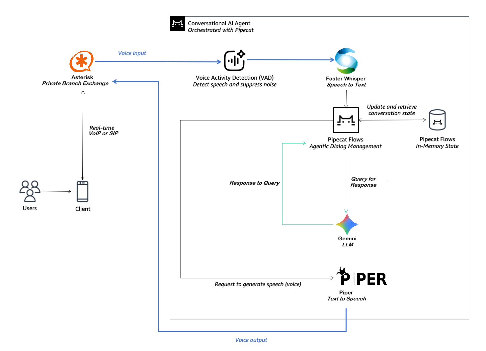

# Botler: AI-Powered Customer Engagement Platform

**Project Title:** Botler: AI-Powered Customer Engagement Platform  
**Team Name:** 404_Sher_NotFound  
**Team Members:** Pranav Prakash, Priyansh Jain  

---
## 1. Demo Video ##  

https://github.com/user-attachments/assets/67261186-bba4-432b-bbd8-975d42ab9b75

## 2. Setup Instructions
### Prerequisites

**Recommended Python Version:** 3.13  
**Hardware:** CUDA capable GPU

### Setup Steps

1. **Clone the repository and navigate to it:**

   ```bash
   git clone https://github.com/pprakash02/botler.git
   cd botler
   ```

2. **Create venv and Install required Python dependencies:**

   ```bash
   python3 -m venv .venv
   source .venv/bin/activate 		
   pip install -r requirements.txt
   ```
3. **Set required Environment Variables:**  
Go to [Groq Console](https://console.groq.com) and create 2 API keys (one for the Voice Agent Brain and the other for Minutes of Meeting Generator). Go to [Sarvam AI Dashboard](https://dashboard.sarvam.ai/) and create an API key.  
   ```bash
   cd src
   ```
   Rename `env.example` to `.env` and add your keys for `GROQ_API_KEY`, `MOM_GROQ_API_KEY` and `SARVAM_API_KEY`.
4. **Telephony:**  
    Install `Asterisk 22.8.2` from source (Linux distro maintained packages may be old). Follow     the instructions given in [Asterisk Docs](https://docs.asterisk.org/Getting-Started/Installing-Asterisk/Installing-Asterisk-From-Source/).  
Navigate to `/etc/asterisk` and set the Asterisk config files as given in the `/configs` directory of `/botler`.  
(Note: You may need `sudo` privileges to change config files and run Asterisk)  
Setup your SIP client according to `pjsip.conf`. We are using UDP transport, with Username `6001` and Password `unsecurepassword` for our demo. Get the Domain for Asterisk server by running :
   ```bash
   ip addr show
   ```  
   We recommend using [Linphone](https://www.linphone.org/en/download/) with [Third party SIP account](https://www.linphone.org/en/docs/login-sip-account/) as it is open-source and easy to use.

5. **Run Asterisk and Launch Botler:**
   ```bash
   sudo asterisk
   python3.13 main.py
   ```
   (Note: Run asterisk first then setup your SIP client. Also do not keep the program idle for more than 5 minutes. The pipeline will timeout and close in 5 minutes to save resources and you'll need to run the program again.)  
   
   **For inbound:**
   You will see a prompt for `inbound/outbound:`, type `inbound` and press `Enter` to test for inbound calls. (The first run will take some time to start because `Faster Whisper` and `Piper` models will be downloaded.)   
Once you see the Tail interface on your terminal, dial any number on your Linphone client (ex: `999`) and talk to the voice agent.  
(When using the Free Tier of Groq API key, you may experience rate limits.)  
When you are satisfied disconnect the call, the MoM will be automatically generated and stored in `/src`.

   **For outbound:**
   You will see a prompt for `inbound/outbound:`, type `outbound` and press `Enter` to test for inbound calls. (The first run will take some time to start because `Faster Whisper` and `Piper` models will be downloaded.)   
Once you see the Tail interface on your terminal,open another terminal window in `/botler` and run:  
   ```bash
   source .venv/bin/activate
   cd src
   python3.13 outbound.py
   ```
     You will see a prompt for `Enter destination number:`, type `6001` and press `Enter`. You will receive a call on your Linphone client with the caller ID `Botler`.   
(When using the Free Tier of Groq API key, you may experience rate limits.)  
When you are satisfied disconnect the call, the recording of the call will be saved in `/src/recordings/` and the MoM (Minutes Of Meeting) will be automatically generated and stored in `/src/generated_mom`.

   **For Minutes Of Meeting:**

   We support multilingual recordings for Minutes Of Meeting generation. (English, Hindi, Bengali, Tamil etc.)  
   Place your recordings in `/src/recordings`, and open terminal in `/botler` and run:
      ```bash
   source .venv/bin/activate
   cd src
   python3.13 mom_generator.py
   ```

---

## 3. Architecture Diagram

  

The pipeline utilizes a streaming-first architecture connecting Asterisk with Pipecat. 

Audio flows from Asterisk into Pipecat, where Voice Activity Detection (VAD) handles noise suppression. The stream is transcribed by Faster-Whisper, processed by Groq for intent, and synthesized back into audio by Piper TTS before returning to the caller. When the call is disconnected Pipecat calls functions from `mom_generator.py` to create Minutes of Meeting for the call and writes them to a file.

---

## 4. Tech Stack Used

* **Language:** Python
* **Telephony:** Asterisk
* **STT:** Faster-Whisper
* **LLM:** Groq API (gpt-oss-120b)
* **TTS:** Piper (`en_US-amy-medium` voice)
* **VAD:** Silero VAD
* **Orchestration:** Pipecat
* **Outbound Calling:** Asterisk Manager Interface (AMI)

---
## 5. Additional Info
   For detailed documentation regarding approach to the problem, Justification for Technical  Selection, Advantages Over Alternative solutions, Technical  Implementation Details, High Level Architectural Design, take a look at our [Project Proposal](./assets/botler-project-proposal.pdf).
